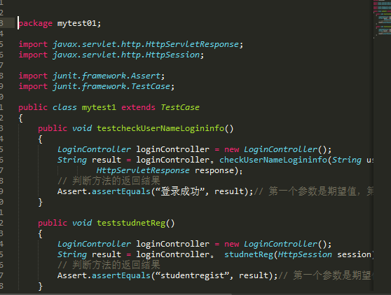
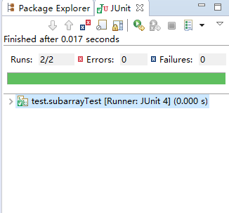
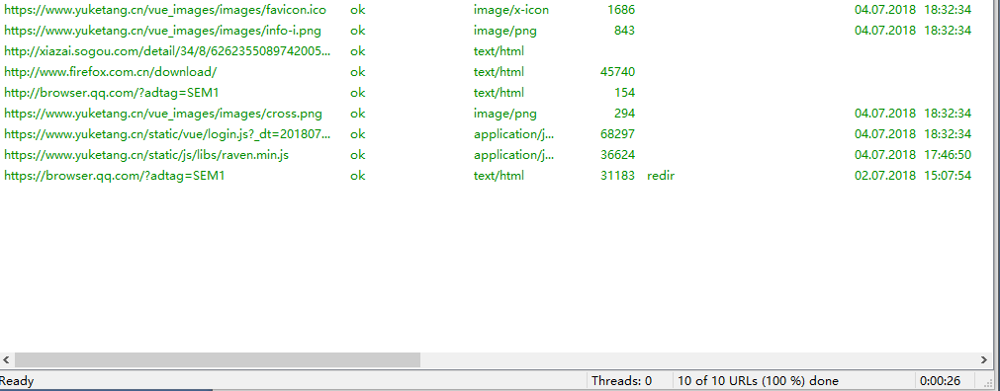
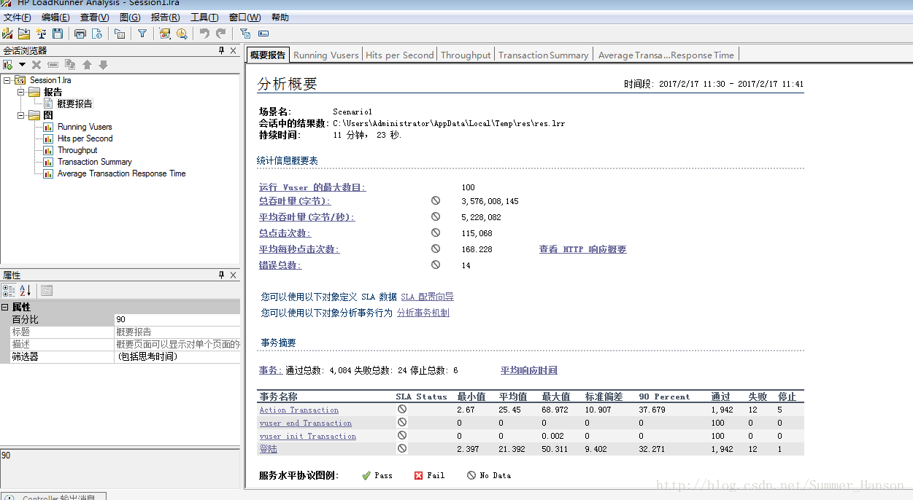
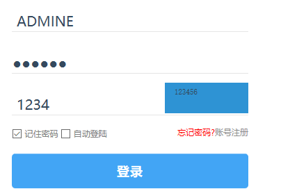
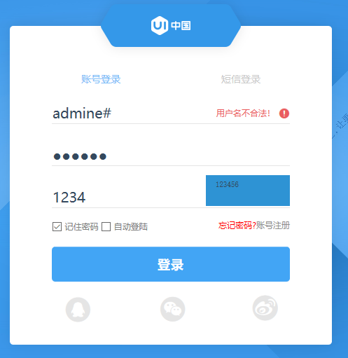
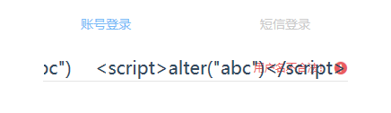

#学习系统测试文档
##单元测试
####测试工具：junit
####单元测试主要针对系统设计中的单个单元或者模块进行单独设计，具体的最小可测单元在我们设计的工程中，我们可以为一个个的功能类及逆行测试，用来验证我们所实现的逻辑业务是否正确；在设计测试时，主要从我们的系统实现功能来分析，比如用户输入已经存在的账号和密码，选则登录操作后，根据设计逻辑，系统判断成功后提示用户登录成功，因此，为了判断我们的登录函数是否正确实现，我们可以利用junit工具，选择对登录函数进行验证，编写测试程序，通过断言函数asseertequal（）将返回结果同实现安排好的登陆成功信息进行比较处理，在eclipse中将程序选择run as，选择junit进行测试，查看结果；
####上述提到的仅是测试一个登录单元模块的方法，在我们的系统之中，还涉及到提交，注册，查看，验证码获取等模块，我们同样可以设计同上述的测试方法进行单元测试，测试的代码和结果如下：

####上述代码主要针对用户注册登录进行测试，通过将用户正确的信息判断后，通过比较返回信息判断登录函数是否正确处理，测试结果如下：

####测试功能函数正确通过，说明我们设计的函数可以使用。从单元测试的结果分析来看，我们所设计的极大模块中的具体函数实现通过junit测试，说明我们可以正常使用到工程中。
##功能测试
###表单测试
####在我们设计的web工程中，由于我们支持用户进行注册登录和提交查看作业成绩等操作，因此我们需要用表单进行数据采集，为保证信息格式的正确性，我们需要设计对应的测试用例进行输入，提交和数据库处理结果检查。测试的主要目的在于确定表单设计采集信息的正确性。根据比较成熟的思路分析，我们的测试用例可从系统支持和不支持两种数据格式进行用例设计，设计用例体现如下：

####在登录界面表单中，我们对文本框中的账号和密码进行测试，在手机号注册选项中，我们在文本框输入长度大于正常手机号码的字符串，结果如下：

####提示我们手机号不合法，说明系统能够正确判断输入信息的格式；
####在学生查询界面表单中，主要对输入查询的信息进行测试，我们输入空格和课程信息进行验证，系统均可以进行响应查询处理：

####对于空格格式，我们在查询表单中可以进行更合理的设计，提示用户输入信息，我们可以在后续工作中及逆行完善；
####数据库测试方面，我们主要判断数据库内容是否对表单内容进行保存，以及保存的内容与提交的内容是否一致，根据设计的功能实现，我们主要对用户提交的内容和用户注册的用例进行设计测试，在数据库中对数据进行检查是否正确，过程如下：
####我们首先在登录注册界面注册新用户，保存好其账号和密码，提交之后系统提示其注册成功，在这些操作完成之后，我们判断数据库是否对此作出正确的保存响应，即对数据库中的用户信息进行查看，查找结果中可以看到信息已经保存；
####我们根据上方展示结果可以看到，在网络良好的环境下，用户完成主界面中的注册信息或者是提交内容后，服务端进行数据处理后，数据库可以及时添加对应的账户管理信息，表单测试通过。
###链接测试
####测试工具：Xenu Link Sleuth
####在我们的工程实现后，涉及到用户操作的过程中，界面交互时，需要系统能够及时地对操作走出正确的界面跳转响应以便完成具体对应的操作，因此我们需要对我们的工程进行链接测试，检查是否存在死链接。
####在测试过程中，我们使用的是链接测试工具Xenu Link Sleuth。Xenu Link Sleuth支持我们输入我们的web工程部署后的url，通过url进行检测链接。具体操作过程为：
####单击File->Check URL,打开测试界面。在这个界面中，输入我们所需要检测的远程地址或者是选择我们本地的网页文件，在这里由于我们工程是本地的，所以我们选择我们的网页文件进行测试，点击OK按钮后，即可查看出网站的活链接以及死链接，并指出了详细的转向链接，其中，ok、mail host ok ：表示链接正常；timeout、no connection、no such host：表示访问超时或者无法访问（不代表是空链）；not found：如果是not found，表示没有找到，即空链接。我们使用此工具的测试结果如下：

####根据结果我们分析可以看到，在我们完成的项目中，所有的链接均可以正常响应，说明链接测试通过。
##性能测试
####在完成我们工程基本的功能测试，并测试通过之后，我们接下来对工程进行性能测试，从系统对用户发出的请求进行处理的角度来讲，我们主要考虑系统响应时间，吞吐量以及并发数量等指标，我们此次测试主要为负载测试和压力测试，通过自动化的测试工具模拟多种正常、峰值以及异常负载条件来对系统的各项性能指标进行测试。
####测试工具：loadrunner
####测试过程：
####Loadrunner是我们进行压力测试时所采用的一款测试工具，在测试过程中，我们首先将我们的工程url输入进去之后，选择录制，工具自动自行录制事件，在这里我们进行用户登录事件Action的录制，当我们录制完成后，loadrunner会自动生成录制脚本，接下来我们通过loadrunner生成的脚本进行登录事件模拟，运行时会自动显示模拟的多次事件情况下的用户点击次数，系统每秒响应事件和失败的事务次数等，最后我们选择loadrunner自动生成的测试报告进行模拟事务请求处理结果查看，确定系统的性能
####过程和结果如下：

####从loadrunner所生成的测试报告来看，在测试的平均每秒168次点击中，在录制的事件里，通过的登录总次数1942次，通过平均有12次未通过，最后的判断结果足以表明我们的压力测试通过。
##安全测试
####对于我们的系统而言，用户在使用时，首先需要进行注册，成功之后，选择登录进入系统，系统通过账号和密码进行验证。因此，我们需要测试有效和无效的用户名和密码，需要考虑系统在验证登录时，是否大小写敏感，是否可以不登陆而直接浏览某个页面等。
####验证用户是否可以不登陆直接进入系统：
####我们在登录界面设计对应测试，对用户的账号和密码直接为空，选择登录，结果如下：

####可以观察到在账户密码为空时，不能够选择登录，即无法登录进去，说明用户无法不登陆直接进入系统；
####验证系统登录时是否大小写敏感：
####在账号输入时，将账号的•小写字母变成大写字母，将账号admine改写为ADMINE：

####选择登录后，我们可以看到系统提示用户不存在，说明我们可以验证系统在验证登录时，是对大小写敏感，不可以不登陆而直接浏览某个页面，保证了系统的安全性。
###Sql注入：
####SQL注入是一种将SQL代码添加到输入参数中，传递到服务器解析并执行的一种攻击手法。SQL注入攻击是输入参数未经过滤，然后直接拼接到SQL语句当中解析，执行达到预想之外的一种行为，称之为SQL注入攻击。当我们在输入框中输入某些特定参数时，由于可能存在的未过滤参数的情况，导致一些潜在的sql代码同参数结合在一起，形成特定的sql语句，可能会对数据库进行更改，导致一些不易发现的错误。
####下面我们进行sql漏洞存在测试，我们在主界面有账号和密码均为admin的用户，现在我们在账号后添加单引号#，添加之后，我们随便对密码进行输入，现在我们输入错误密码ad（原始正确密码为admine），观察是否可以登录；因为如果系统没有过滤输入参数的话，#会加入到我们设计的mysql语句中，从而导致sql语句后面都被注释掉了，如果能够登录，则说明系统没有对#进行过滤，存在漏洞，我们的测试结果如下：

####系统显示用户名不合法，说明#并没有添加到sql中，说明不存在sql注入。
###测试XSS：
####XSS跨网站脚本攻击是指，由于设计的程序或数据库没有对一些特殊的字符进行过滤或处理，导致用户所输入的一些具有破坏性的脚本语句时，能够直接写进数据库中，浏览器会直接执行这些脚本语句，破坏网站的正常显示，或网站用户的信息被盗,构造脚本语句时，要保证脚本的完整性。
####在设计的测试中，我们在输入文本框中输入下面的语句，判断是否会存在XSS跨网站脚本攻击成功的情况：
####document.write("abc")scrip talter("abc")/script

####输入之后，我们的测试结果显示账号不存在，可以看到，输入后并没有出现攻击成功的情况，因此我们的xss测试通过。
##WebUI测试
###导航测试
####导航是指位于页面顶部或者侧边区域的，它起着链接站点或者软件内的各个页面的作用，我们主要从系统是否易于导航以及导航是否直观，主页是否支持主要功能的获取，页面结构、导航、菜单、连接的风格是否一致等方面进行考虑。
####我们主要设计一下用例进行导航测试：
####测试功能操作是否能够正常跳转；
####测试跳转过程中是否正常显示界面；
####测试界面返回是否正常；
####在我们tomcat开启的工程中，上面的链接和显示均能正常展示，并且在登陆后的主界面上支持主要的用户操作功能，测试通过。
###兼容性测试
####兼容性测试主要考虑我们的工程能够在不同的浏览器中正常打开，并且我们所提供的功能和信息能够正确输入获取和输出，在这里我们主要对主流的浏览器进行验证，包括IE，Chorm，360浏览器，FireFox浏览器等，在测试的结果中，我们的系统均正常响应，兼容性测试通过。

##总结：
  ####我们通过对web工程的设计进行基本的测试，包括单元测试，功能测试，性能测试，安全测试和webui测试，主要对系统的链接，表单，功能进行判断，数据库等方面进行测试，虽然我们的系统对一些数据的处理存在改进，比如搜索文本中的空格格式处理，但总体上我们的工程能完成所设计的用户需求，实现了最初的设计目的。

